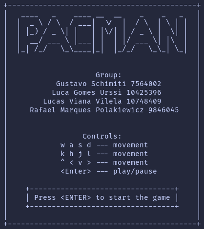
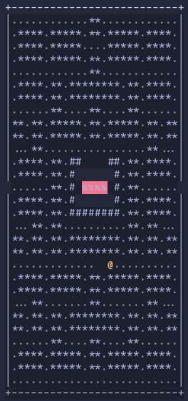

# SSC0140 - Operating Systems --- Pacman

Repository for the main project for the Operating Systems course offered for computer sciece undergraduates at ICMC - USP, by professor Kalinka Castelo Branco.

Simple ASCII implementation of the classic Pacman, focused on using multiple threads and semaphores in order to better understand Operating Systems' concepts.

<div align="center">
  
  
</div>

## Compiling and executing

In a Unix-based system, you can execute:

```bash
make all
```

to compile and

```bash
make run
```

to execute.

## Docker

A Dockerfile is also provided to play the game inside a container. You can use:

```bash
docker build -t name_you_want_for_the_image path/to/the/project_root
```

once to build the Docker image and

```bash
docker run -it image_name
```

whenever, to run the game inside a container.
